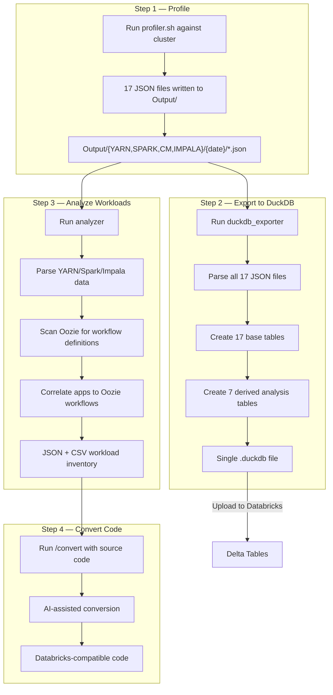
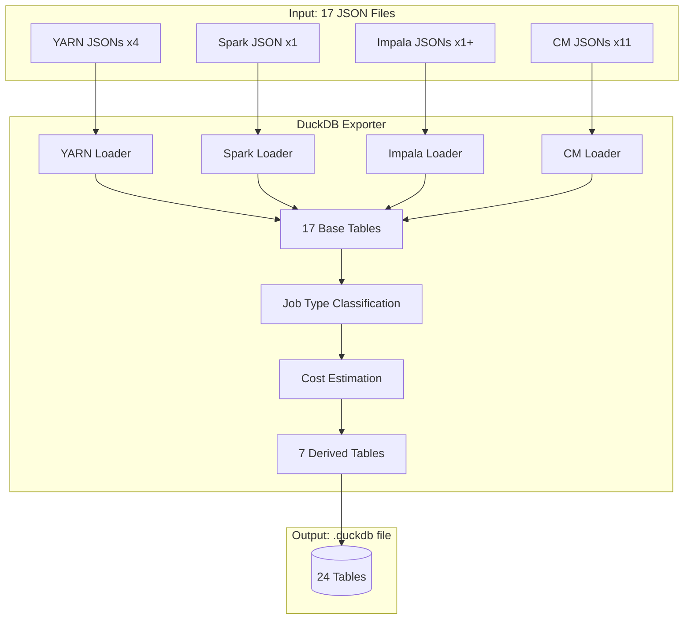
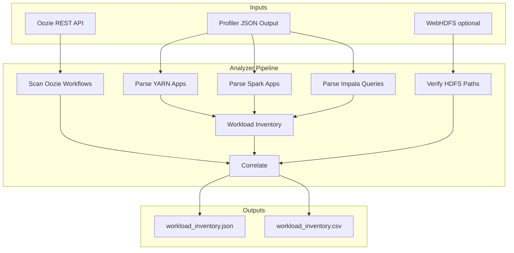
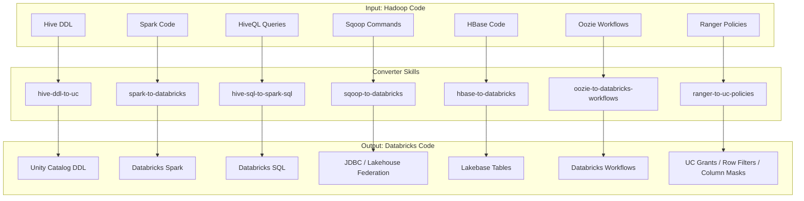
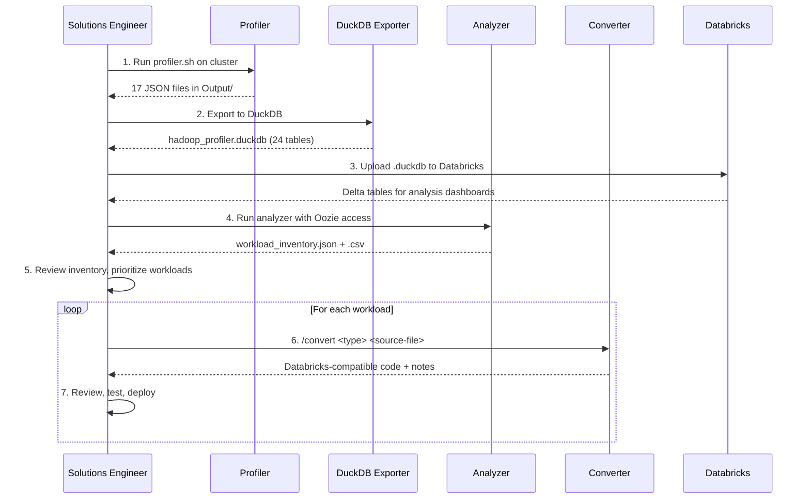

# Hadoop Migration Toolkit — Stakeholder Walkthrough

> End-to-end toolkit for profiling, analyzing, and converting Hadoop workloads to Databricks.

---

## Executive Summary

The Hadoop Migration Toolkit automates the assessment and conversion of on-premises Hadoop clusters to Databricks. It comprises four modules that work as a pipeline:

1. **Profiler** — Extracts cluster metadata and workload history from Hadoop REST APIs
2. **DuckDB Exporter** — Transforms raw JSON into a structured, portable analytical database
3. **Analyzer** — Produces a code-level workload inventory with Oozie workflow correlation
4. **Converter** — AI-assisted conversion of Hadoop code to Databricks equivalents

**Supported Hadoop Distributions:** CDH 5.x/6.x, HDP 2.x/3.x, HDI 3.x/4.x, CDP 7.x

---

## Architecture Overview

```mermaid
flowchart LR
    subgraph Hadoop Cluster
        YARN[YARN ResourceManager]
        SHS[Spark History Server]
        CM[Cloudera Manager API]
        IMP[Impala via CM API]
        OOZ[Oozie Server]
    end

    subgraph "1. Profiler (Bash)"
        PS[profiler.sh]
    end

    subgraph "2. DuckDB Exporter (Python)"
        DX[duckdb_exporter]
    end

    subgraph "3. Analyzer (Python)"
        AN[analyzer]
    end

    subgraph "4. Converter (Claude Code Plugin)"
        CV[/convert command]
    end

    YARN --> PS
    SHS --> PS
    CM --> PS
    IMP --> PS

    PS -->|17 JSON files| DX
    DX -->|.duckdb file| DB[(DuckDB / Delta Tables)]

    PS -->|17 JSON files| AN
    OOZ --> AN
    AN -->|Workload Inventory| CV
    CV -->|Databricks Code| OUT[Converted Notebooks & SQL]
```

---

## Pipeline Data Flow



---

## Module Details

### 1. Profiler (`Profiler/profiler.sh`)

The Profiler is a self-contained Bash script (~790 lines) that extracts cluster metadata and workload history by calling Hadoop REST APIs. It requires only `curl` and `jq` on the extraction host.

#### Inputs

| Input | Description |
|-------|-------------|
| `profiler.conf` | Configuration file specifying cluster endpoints, authentication, and extraction scope |
| Cluster REST APIs | YARN RM, Spark History Server, Cloudera Manager (or Ambari), Impala |
| Authentication | Kerberos keytab or username/password for CM API |

#### Outputs

The Profiler writes **17 JSON files** organized by source:

| Directory | Files | Description |
|-----------|-------|-------------|
| `Output/YARN/{date}/` | `YarnApplicationDump_*.json` | All YARN application history (jobs, users, queues, resource usage) |
| | `YarnMetricsDump_*.json` | Cluster-wide resource metrics (total memory, vcores, node counts) |
| | `YarnNodesDump_*.json` | Node inventory (hostname, rack, memory, cores, health) |
| | `YarnSchedulerDump_*.json` | Queue configuration (fair/capacity scheduler, resource limits) |
| `Output/SPARK/{date}/` | `Spark_Applications_*.json` | Spark application history with attempt details |
| `Output/IMPALA/{date}/` | `impala_*.json` | Impala query history (SQL, duration, rows produced) |
| `Output/CM/{date}/` | `cmHosts_*.json` | Physical host inventory (cores, memory, commission state) |
| | `cmServices_*.json` | Service inventory (HDFS, YARN, Hive, Spark, etc.) |
| | `cmConfig_*.json` | Service configuration export |
| | `cmExport_*.json` | Full Cloudera Manager deployment export |
| | `cmHostRoles_*.json` | Role-to-host mapping (DataNode, NodeManager, etc.) |
| | `cmHDFSUsage_*.json` | HDFS capacity utilization over time |
| | `cmClusterCPUUtilization_*.json` | CPU utilization time series |
| | `cmClusterMemoryUtilization_*.json` | Memory utilization time series |
| | `cmYarnMemoryAndCPU_*.json` | YARN resource utilization time series |
| | `cmYarnUtilization_*.json` | YARN queue utilization time series |
| | `cmImpalaUtilization_*.json` | Impala utilization time series |

#### Key Capabilities

- Zero-install on target cluster — only needs `curl` + `jq`
- Non-intrusive read-only API calls
- Kerberos and SSL support
- Configurable date ranges and pagination
- Works across CDH, HDP, HDI, and CDP distributions

---

### 2. DuckDB Exporter (`Profiler/duckdb_exporter/`)

The DuckDB Exporter is a Python post-processor that transforms the Profiler's 17 raw JSON files into a single portable DuckDB database with 24 structured tables.



#### Inputs

| Input | Description |
|-------|-------------|
| `Output/` directory | Profiler JSON output (17 files) |
| Config YAML | Cost rates (DBU/VM), source filtering, output path |

#### Outputs

| Output | Description |
|--------|-------------|
| `.duckdb` file | Single portable database file with 24 tables |

#### Table Inventory (24 tables)

**Base Tables (17):**

| Table | Source | Description |
|-------|--------|-------------|
| `yarn_applications` | YARN | All application history with resource usage |
| `yarn_cluster_metrics` | YARN | Cluster-wide resource totals |
| `yarn_nodes` | YARN | Node inventory |
| `yarn_scheduler_queues` | YARN | Queue configuration (flattened hierarchy) |
| `spark_applications` | Spark HS | Application history with attempt details |
| `impala_queries` | Impala | Query history with duration and row counts |
| `cm_hosts` | CM | Physical host inventory |
| `cm_services` | CM | Service inventory |
| `cm_config` | CM | Service configuration key-value pairs |
| `cm_export` | CM | Raw deployment export (JSON blob) |
| `cm_host_roles` | CM | Role-to-host mapping |
| `cm_hdfs_usage` | CM | HDFS utilization time series |
| `cm_cpu_utilization` | CM | CPU utilization time series |
| `cm_memory_utilization` | CM | Memory utilization time series |
| `cm_yarn_memory_cpu` | CM | YARN resource time series |
| `cm_yarn_utilization` | CM | YARN queue utilization time series |
| `cm_impala_utilization` | CM | Impala utilization time series |

**Derived / Analysis Tables (7):**

| Table | Description |
|-------|-------------|
| `yarn_analysis_vw` | Job type classification + cost estimates for every YARN app |
| `oozie_analysis_vw` | Filtered to Oozie launcher applications only |
| `hourly_yarn_view` | Hourly aggregation of jobs, resources, and cost |
| `workload_summary_by_user` | Per-user: total jobs, cost, avg duration |
| `workload_summary_by_queue` | Per-queue: total jobs, cost, unique users |
| `workload_summary_by_type` | Per-job-type: total jobs, avg duration, cost |
| `export_metadata` | Export timestamp, table counts, cost rates used |

#### Job Type Classification Logic

The `yarn_analysis_vw` table classifies every YARN application:

| Pattern | Classification |
|---------|---------------|
| `oozie:launcher:T=spark%` | Spark (Oozie) |
| `oozie:launcher:T=hive%` | Hive (Oozie) |
| `oozie:launcher:T=sqoop%` | Sqoop (Oozie) |
| `oozie:launcher%` | Oozie Launcher |
| `application_type = 'SPARK'` | Spark |
| Name starts with SQL keyword | Hive |
| Name contains `sqoop` | Sqoop |
| `application_type = 'MAPREDUCE'` | MapReduce |

#### Key Capabilities

- Single portable `.duckdb` file — no server required
- Configurable cost estimation (DBU rate + VM rate per GB-hour)
- Job type classification matching the Analyzer's logic
- Hourly and per-user/queue/type summary views
- CLI: `python -m duckdb_exporter export|validate|query`
- Direct upload to Databricks for trivial Delta table conversion

#### CLI Examples

```bash
# Export profiler output to DuckDB
python -m duckdb_exporter export \
    --profiler-output ./Output \
    --output ./hadoop_profiler.duckdb

# Validate profiler output directory
python -m duckdb_exporter validate --profiler-output ./Output

# Query the exported database
python -m duckdb_exporter query \
    --db ./hadoop_profiler.duckdb \
    --sql "SELECT job_type, COUNT(*) FROM yarn_analysis_vw GROUP BY job_type"
```

---

### 3. Analyzer (`Analyzer/`)

The Analyzer is a Python tool that produces a code-level workload inventory by parsing Profiler output and correlating it with Oozie workflow definitions.



#### Inputs

| Input | Description |
|-------|-------------|
| Profiler `Output/` directory | JSON files from profiler.sh |
| Oozie REST API | Workflow and coordinator definitions (optional, requires network access) |
| WebHDFS | Path verification for scripts/JARs referenced in workflows (optional) |
| `analyzer.conf.yaml` | Configuration: Oozie URL, auth, output paths |

#### Outputs

| Output | Description |
|--------|-------------|
| `workload_inventory.json` | Structured inventory with per-workload details |
| `workload_inventory.csv` | Flat CSV for spreadsheet analysis |

Each workload entry includes:

| Field | Description |
|-------|-------------|
| `workload_name` | Application or query name |
| `workload_type` | Hive, Spark, Sqoop, MapReduce, Impala, etc. |
| `source` | YARN, Spark HS, or Impala |
| `user` | Submitting user |
| `queue` | YARN queue |
| `resource_usage` | Memory-seconds, vcore-seconds, duration |
| `oozie_workflow` | Correlated Oozie workflow name (if applicable) |
| `oozie_coordinator` | Parent coordinator (if applicable) |
| `code_references` | Scripts, JARs, SQL files from Oozie action definitions |
| `dependencies` | HDFS paths, Hive tables, external systems |

#### Oozie Correlation

The Analyzer uses YARN application names to correlate jobs back to Oozie workflows:

```
Pattern: oozie:launcher:T=<type>:W=<workflow>:A=<action>:ID=<id>

Example: oozie:launcher:T=spark:W=etl_daily:A=spark-transform:ID=0000042-...
  → type: spark
  → workflow: etl_daily
  → action: spark-transform
```

This correlation recovers the orchestration context that YARN alone cannot provide — linking individual jobs to their parent workflows and coordinators.

#### Supported Oozie Action Types

| Action Type | What's Extracted |
|-------------|-----------------|
| Spark | Main class, JAR path, spark-opts, configuration |
| Hive / Hive2 | SQL script path, HiveServer2 JDBC URL, parameters |
| Sqoop | Command string, JDBC connection, table names |
| Shell | Script path, arguments, environment |
| MapReduce | Mapper/Reducer classes, input/output paths |
| Sub-workflow | Child workflow app-path |

#### Key Capabilities

- Parses all Profiler output formats (YARN, Spark, Impala, CM)
- Oozie workflow/coordinator scanning with Kerberos support
- Automatic job-to-workflow correlation via launcher name patterns
- WebHDFS path verification for referenced scripts and JARs
- JSON + CSV output for downstream consumption
- CLI: `python -m analyzer parse-profiler|analyze|scan-oozie|verify-paths`

#### CLI Examples

```bash
# Full analysis: parse profiler output + scan Oozie + correlate
python -m analyzer analyze --config analyzer.conf.yaml

# Parse profiler output only (no Oozie)
python -m analyzer parse-profiler --profiler-output ./Output

# Scan Oozie workflows independently
python -m analyzer scan-oozie --config analyzer.conf.yaml

# Verify HDFS paths from inventory
python -m analyzer verify-paths --inventory workload_inventory.json
```

---

### 4. Converter (`Converter/`)

The Converter is a Claude Code plugin providing AI-assisted conversion of Hadoop code to Databricks equivalents. It provides 7 specialized skills invoked via the `/convert` slash command.



#### Inputs

| Input | Description |
|-------|-------------|
| Source code files | Hive DDL, Spark scripts, HiveQL, Sqoop commands, HBase code, Oozie XML, Ranger policy JSON |
| Workload inventory | Output from Analyzer (provides migration context) |

#### Outputs

| Output | Description |
|--------|-------------|
| Converted code | Databricks-compatible equivalents of each input |
| Migration notes | Explanations of changes, manual review items, compatibility warnings |

#### Conversion Skills

| Skill | From | To | Key Transformations |
|-------|------|----|---------------------|
| `hive-ddl-to-uc` | Hive DDL | Unity Catalog DDL | `STORED AS` → Delta, `LOCATION` → managed tables, `SERDE` removal, 3-level namespace |
| `spark-to-databricks` | OSS Spark | Databricks Spark | `SparkSession.builder` → `spark` (pre-initialized), HDFS paths → DBFS/Volumes, Hive metastore → Unity Catalog |
| `hive-sql-to-spark-sql` | HiveQL | Databricks SQL | `SORT BY` → `ORDER BY`, `DISTRIBUTE BY` → `CLUSTER BY`, UDF syntax, Hive-specific functions |
| `sqoop-to-databricks` | Sqoop | JDBC / Lakehouse Federation | Sqoop import → `spark.read.jdbc()` or Lakehouse Federation, incremental modes |
| `hbase-to-databricks` | HBase | Lakebase (Postgres) | Row key → primary key, column families → columns, `Put/Get/Scan` → SQL |
| `oozie-to-databricks-workflows` | Oozie XML | Databricks Workflows | `workflow.xml` → JSON task definitions, coordinators → scheduled triggers, forks → parallel tasks |
| `ranger-to-uc-policies` | Ranger JSON | UC Grants + UDFs | Ranger ACLs → GRANT/REVOKE, row filters → UDFs, column masks → UDFs, deny → REVOKE |

#### Key Capabilities

- AI-assisted conversion with context-aware transformations
- Handles common migration patterns (HDFS → DBFS, Hive → Unity Catalog)
- Preserves business logic while adapting to Databricks APIs
- Produces migration notes highlighting manual review items
- Works standalone or paired with Analyzer inventory for bulk conversion

#### Usage

```bash
# Convert Hive DDL to Unity Catalog
/convert hive-ddl create_tables.sql

# Convert Spark application to Databricks
/convert spark etl_job.py

# Convert HiveQL queries to Databricks SQL
/convert hive-sql analytics_queries.sql

# Convert Sqoop commands
/convert sqoop sqoop_import.sh

# Convert Oozie workflow
/convert oozie workflow.xml

# Convert Ranger policies to UC grants
/convert ranger ranger_policies_export.json
```

---

## End-to-End Workflow



### Step-by-Step

| Step | Action | Tool | Time Estimate |
|------|--------|------|---------------|
| 1 | Run Profiler against Hadoop cluster | `profiler.sh` | 5-30 min |
| 2 | Export JSON to DuckDB | `python -m duckdb_exporter export` | < 1 min |
| 3 | Upload DuckDB to Databricks, convert to Delta | Databricks notebook | < 5 min |
| 4 | Run Analyzer with Oozie correlation | `python -m analyzer analyze` | 2-10 min |
| 5 | Review workload inventory, prioritize | Manual review of JSON/CSV | Variable |
| 6 | Convert each workload | `/convert <type> <file>` | 1-5 min each |
| 7 | Review and test converted code | Manual + Databricks | Variable |

---

## Key Metrics Available

After running the full pipeline, stakeholders get visibility into:

| Metric | Source Table | Example Query |
|--------|-------------|---------------|
| Total workloads by type | `yarn_analysis_vw` | `SELECT job_type, COUNT(*) FROM yarn_analysis_vw GROUP BY job_type` |
| Estimated migration cost (DBUs) | `yarn_analysis_vw` | `SELECT SUM(dollar_dbus) FROM yarn_analysis_vw` |
| Resource usage by user | `workload_summary_by_user` | `SELECT * FROM workload_summary_by_user ORDER BY total_cost DESC` |
| Queue utilization | `workload_summary_by_queue` | `SELECT * FROM workload_summary_by_queue` |
| Peak usage hours | `hourly_yarn_view` | `SELECT * FROM hourly_yarn_view ORDER BY total_apps DESC LIMIT 10` |
| Cluster hardware inventory | `cm_hosts` | `SELECT hostname, num_cores, total_phys_mem_gb FROM cm_hosts` |
| Service inventory | `cm_services` | `SELECT service_name, service_type, service_state FROM cm_services` |
| Impala query complexity | `impala_queries` | `SELECT query_type, COUNT(*), AVG(duration_millis) FROM impala_queries GROUP BY query_type` |
| Oozie workflow catalog | Analyzer inventory | Review `workload_inventory.json` for orchestrated pipelines |

---

## Prerequisites

| Component | Requirements |
|-----------|-------------|
| **Profiler** | `curl`, `jq` on a host with network access to cluster APIs |
| **DuckDB Exporter** | Python 3.8+, `duckdb>=0.10.0`, `pyyaml>=6.0` |
| **Analyzer** | Python 3.8+, `pyyaml>=6.0`, `requests` (for Oozie/WebHDFS) |
| **Converter** | Claude Code CLI with the Converter plugin installed |

---

## File Structure

```
src/hadoop/
├── Profiler/
│   ├── profiler.sh                    # Main profiler script (Bash)
│   ├── profiler.conf                  # Cluster configuration
│   ├── requirements.txt               # Python dependencies
│   ├── duckdb_exporter.conf.yaml      # DuckDB exporter configuration
│   ├── duckdb_exporter/               # DuckDB export module (14 Python files)
│   │   ├── __main__.py                # CLI entry point
│   │   ├── config.py                  # YAML config loader
│   │   ├── schema.py                  # 17 CREATE TABLE DDL statements
│   │   ├── exporter.py                # Main orchestrator
│   │   ├── utils.py                   # File discovery, timestamp parsing
│   │   ├── loaders/                   # JSON → DuckDB table loaders
│   │   │   ├── yarn_loader.py         # 4 YARN loaders
│   │   │   ├── spark_loader.py        # Spark application loader
│   │   │   ├── impala_loader.py       # Impala query loader
│   │   │   └── cm_loader.py           # 11 CM data loaders
│   │   └── transforms/                # Derived table generators
│   │       ├── yarn_analysis.py       # Job classification + cost views
│   │       └── summary_tables.py      # Per-user/queue/type summaries
│   └── tests/                         # 6 test files
├── Analyzer/
│   ├── analyzer/                      # Analysis module (14 Python files)
│   │   ├── cli.py                     # CLI with 4 subcommands
│   │   ├── config.py                  # YAML config loader
│   │   ├── parsers/                   # YARN, Spark, Impala, CM parsers
│   │   ├── oozie/                     # Oozie scanner + action extractors
│   │   ├── inventory.py               # Workload inventory builder
│   │   └── reporters/                 # JSON + CSV output formatters
│   ├── tests/                         # 4 test files + 6 fixtures
│   └── README.md
└── Converter/
    ├── plugin.json                    # Claude Code plugin manifest
    ├── commands/
    │   └── convert.md                 # /convert slash command router
    ├── skills/                        # 6 conversion skills
    │   ├── hive-ddl-to-uc/
    │   ├── spark-to-databricks/
    │   ├── hive-sql-to-spark-sql/
    │   ├── sqoop-to-databricks/
    │   ├── hbase-to-databricks/
    │   ├── oozie-to-databricks-workflows/
    │   └── ranger-to-uc-policies/
    └── README.md
```
