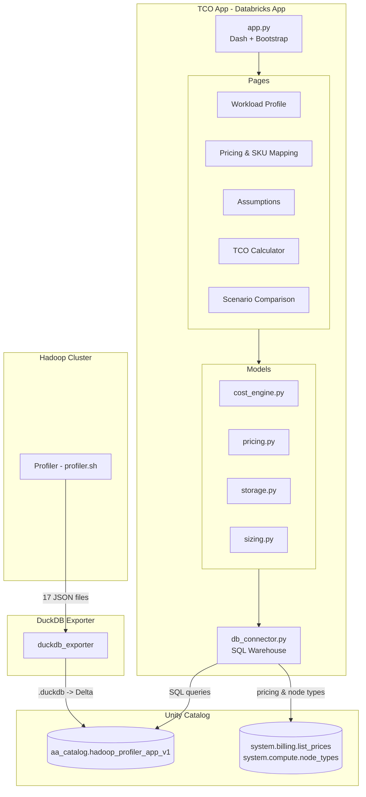
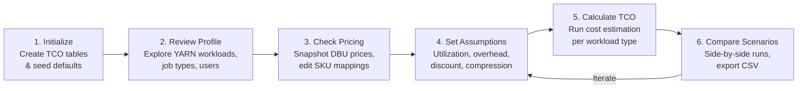
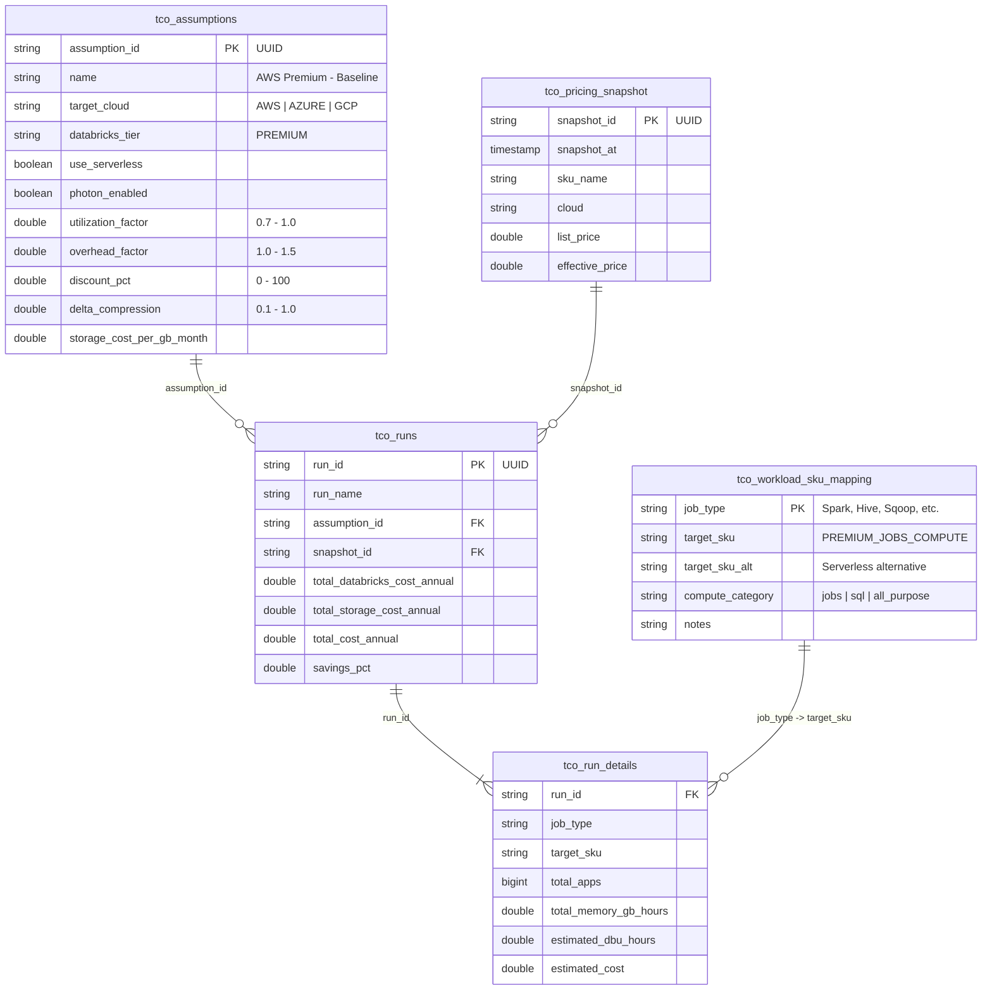
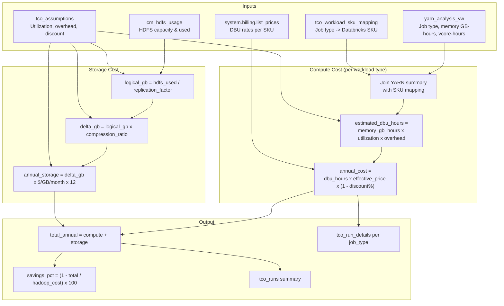

# Hadoop to Databricks TCO Calculator

A multi-page Dash application for estimating total cost of ownership when migrating Hadoop workloads to Databricks. Reads profiler data from Unity Catalog, applies configurable assumptions, and produces per-workload cost breakdowns with savings analysis.

**Live URL:** `https://hadoop-tco-calculator-<workspace-id>.aws.databricksapps.com`

## Source Model

The cost model is ported from the field Hadoop TCO spreadsheet
["Visa DPI Hadoop Migration Profile"](https://docs.google.com/spreadsheets/d/1MRyQ68Eoan7UWPWDt0AyPXKqzAAxbdKv_hLBY6N036k/edit)
— treat it as a **read-only reference**. The `Lookups- Other` tab
(gid `1772732033`) is the source for `models/constants.py` and
`db/seed_lookups.sql`: VM discounts, performance gains, DBSQL utilization,
storage $/GB/mo, and DBU rates by cloud + pricing tier. That workbook is marked
"Confidential, do not share with customer".

Known drift from the sheet (not yet reconciled):

| Value | Sheet | Code |
|---|---|---|
| AWS hot storage $/GB/mo | $0.026 | $0.023 (`seed_lookups.sql`) |
| AWS Premium all-purpose DBU | $0.55 | 0.40 (`DBU_RATES`) |
| Per-cloud DBU rates | AWS/Azure differ per tier | all clouds identical |

---

## Architecture



## User Journey



## Data Model



## Cost Calculation Flow



## Pages

| Page | Route | Purpose |
|------|-------|---------|
| **Workload Profile** | `/` | Read-only summary of profiler data: job type breakdown, hourly heatmap, top users/queues |
| **Pricing & SKU Mapping** | `/pricing` | View/snapshot Databricks prices, edit workload-to-SKU mappings |
| **Assumptions** | `/assumptions` | Create/load named assumption sets (utilization, overhead, discount, compression) |
| **TCO Calculator** | `/calculator` | Run cost estimation, view per-workload breakdown + sizing + storage |
| **Scenario Comparison** | `/scenarios` | Compare 2-3 runs side-by-side, export to CSV |

## File Structure

```
tco_app/
├── app.py                    # Dash entry point, sidebar navigation
├── app.yaml                  # Databricks Apps deployment config
├── requirements.txt          # Python dependencies
├── db/
│   ├── schema.sql            # 5 TCO tables (DDL)
│   └── seed_data.sql         # Default SKU mappings + 4 baseline assumptions
├── models/
│   ├── cost_engine.py        # TCO calculation orchestrator
│   ├── pricing.py            # Pricing snapshots from system.billing
│   ├── storage.py            # HDFS -> Delta storage cost estimation
│   └── sizing.py             # Instance type recommendations
├── pages/
│   ├── workload_profile.py   # Page 1: Profiler data summary
│   ├── pricing.py            # Page 2: SKU mapping + price management
│   ├── assumptions.py        # Page 3: Configurable TCO inputs
│   ├── calculator.py         # Page 4: Run TCO calculation
│   └── scenarios.py          # Page 5: Compare runs
└── utils/
    ├── db_connector.py       # Databricks SQL connection (SDK auth)
    └── export.py             # CSV export utilities
```

## Seed Data

**10 job type mappings** cover standard Hadoop workloads:

| Hadoop Job Type | Primary SKU | Serverless Alt | Category |
|----------------|-------------|----------------|----------|
| Spark (Oozie) | PREMIUM_JOBS_COMPUTE | PREMIUM_JOBS_SERVERLESS | jobs |
| Spark | PREMIUM_ALL_PURPOSE_COMPUTE | PREMIUM_JOBS_COMPUTE | all_purpose |
| Hive (Oozie) | PREMIUM_SQL_COMPUTE | SERVERLESS_SQL_COMPUTE | sql |
| Hive | PREMIUM_SQL_COMPUTE | SERVERLESS_SQL_COMPUTE | sql |
| Sqoop (Oozie) | PREMIUM_JOBS_COMPUTE | - | jobs |
| Sqoop | PREMIUM_JOBS_COMPUTE | - | jobs |
| MapReduce | PREMIUM_JOBS_COMPUTE | - | jobs |
| Oozie Launcher | PREMIUM_JOBS_COMPUTE | - | jobs |
| Impala | PREMIUM_SQL_COMPUTE | SERVERLESS_SQL_COMPUTE | sql |
| Other | PREMIUM_ALL_PURPOSE_COMPUTE | - | all_purpose |

**4 baseline assumption sets:**

| Name | Cloud | Serverless | Utilization | Overhead | Storage $/GB/mo |
|------|-------|------------|-------------|----------|-----------------|
| AWS Premium - Baseline | AWS | No | 0.9 | 1.1 | $0.023 |
| AWS Premium - Serverless | AWS | Yes | 0.85 | 1.05 | $0.023 |
| Azure Premium - Baseline | Azure | No | 0.9 | 1.1 | $0.018 |
| Conservative Estimate | AWS | No | 0.7 | 1.3 | $0.023 |

## Deployment

### Deploy to Databricks Apps

```bash
# 1. Upload source files
#    import-dir does NOT respect .gitignore, so it will happily upload
#    __pycache__/ and .databricks/ (which makes the build log emit spurious
#    "Updated file: .../sync-snapshots/*.json" lines). Purge them after import.
databricks workspace import-dir ./tco_app \
  /Workspace/Users/<you>/hadoop-tco-calculator --overwrite

for d in __pycache__ models/__pycache__ pages/__pycache__ utils/__pycache__ .databricks; do
  databricks workspace delete \
    "/Workspace/Users/<you>/hadoop-tco-calculator/$d" --recursive 2>/dev/null
done

# 2. Create the app
databricks apps create hadoop-tco-calculator \
  --description "Hadoop to Databricks TCO Calculator"

# 3. Deploy
databricks apps deploy hadoop-tco-calculator \
  --source-code-path /Workspace/Users/<you>/hadoop-tco-calculator

# 4. Add SQL warehouse resource (required for SP access)
databricks apps update hadoop-tco-calculator --json '{
  "resources": [{
    "name": "sql-warehouse",
    "sql_warehouse": {"id": "<warehouse-id>", "permission": "CAN_USE"}
  }]
}'
```

### Grant UC Permissions to App Service Principal

Use the SP's **application ID (UUID)**, not its display name — UC rejects the
display name with `PRINCIPAL_DOES_NOT_EXIST`. Get it from
`databricks apps get <app-name>` (`service_principal_client_id`).

```sql
-- <sp-app-id> e.g. 1ce16c21-2ec7-40ca-8faa-6f99915e1fe0
GRANT USE CATALOG ON CATALOG profiler TO `<sp-app-id>`;
GRANT USE SCHEMA ON SCHEMA profiler.demo TO `<sp-app-id>`;
GRANT CREATE TABLE ON SCHEMA profiler.demo TO `<sp-app-id>`;
GRANT SELECT ON SCHEMA profiler.demo TO `<sp-app-id>`;
GRANT MODIFY ON SCHEMA profiler.demo TO `<sp-app-id>`;
GRANT READ VOLUME ON VOLUME profiler.demo.profiler_uploads TO `<sp-app-id>`;
```

The SP also needs `CAN_USE` on the warehouse. Step 4 above binds the warehouse
as an app resource, but that does not always create an explicit ACL entry — add
one directly:

```bash
databricks api patch /api/2.0/permissions/warehouses/<warehouse-id> --json '{
  "access_control_list": [
    {"service_principal_name": "<sp-app-id>", "permission_level": "CAN_USE"}
  ]
}'
```

### Initialize the TCO Tables (required once per schema)

The 10 `tco_*` tables are **not** created by deployment. Until they exist, every
page loads but all dropdowns and tables come back empty — the callbacks catch
`TABLE_OR_VIEW_NOT_FOUND` and return `[]`, so there is no visible error.

Click **Initialize TCO Tables** in the sidebar once (after setting Catalog and
Schema), or run it headlessly:

```bash
python -c "import sys; sys.path.insert(0,'.'); \
  from utils.db_connector import init_schema; init_schema('profiler','demo')"
```

This applies `db/schema.sql` + `db/schema_v2.sql` and seeds `db/seed_data.sql`
(10 SKU mappings, 4 assumption sets) and `db/seed_lookups.sql`. It is safe to
re-run: DDL uses `IF NOT EXISTS` and seeding is skipped when the tables are
non-empty.

The `tco_*` tables can live in the same schema as the profiler data
(e.g. `profiler.demo`) — the sidebar uses one catalog/schema selector for both
the profiler reads and the TCO writes.

### Local Development

```bash
pip install -r requirements.txt

export DATABRICKS_HOST="your-workspace.cloud.databricks.com"
export DATABRICKS_TOKEN="dapi..."
export DATABRICKS_SQL_WAREHOUSE_ID="abc123"

python app.py  # http://localhost:8050
```

## Configuration

`app.yaml` controls the Databricks App runtime:

| Setting | Description |
|---------|-------------|
| `DATABRICKS_HOST` | Injected automatically by the Apps runtime — **do not declare in `app.yaml`** |
| `DATABRICKS_CLIENT_ID` / `_SECRET` | Injected automatically for M2M OAuth |
| `DATABRICKS_APP_PORT` | Port the runtime expects the app to bind (8000); `app.py` reads it |
| `DATABRICKS_SQL_WAREHOUSE_ID` | Resolved from the `sql-warehouse` resource (`valueFrom`), not hardcoded |

`valueFrom` takes a **resource name**, not a built-in. Declaring
`DATABRICKS_HOST: {valueFrom: host}` produces a build-time error
(`resource host not found`) even though the app still starts, because the
runtime injects the variable anyway.

`app.yaml` contains **no workspace-specific IDs** — the warehouse is bound at
deploy time via `databricks apps update ... --json '{"resources": [...]}'`
(step 4 under Deployment). Locally, export `DATABRICKS_SQL_WAREHOUSE_ID`
yourself.

Authentication is automatic: M2M OAuth in Databricks Apps, PAT/profile locally.

## Key Design Decisions

- **Reproducible runs**: Each calculation captures a pricing snapshot + assumption set, so results are deterministic even if prices change later.
- **Single catalog/schema**: One selector in the sidebar controls both profiler reads and TCO table writes. No split config.
- **Editable mappings**: SKU mappings are stored in a table and editable in the UI, not hardcoded.
- **System tables**: Pricing from `system.billing.list_prices`, node types from `system.compute.node_types` (requires account-level access).

## DBU Annualization

The source spreadsheet derives DBUs from static cluster **capacity**
(nodes × vCores/node × %split × utilization) — a figure it labels
"vCPUs 24/7/365", annual by construction with no observation window.

This app deliberately deviates: it uses **measured** profiler workload
(`memory_gb_hours`), which is a better basis but is only an accumulation over
however long the profiler ran. `calculate_tco` therefore measures the window
from `yarn_applications` and scales DBUs by `365 / window_days`:

```
window_dbus    = mem_gb_hours × utilization × overhead × (1 + dev_test) × (1 - perf_gain)
estimated_dbus = window_dbus × annualization_factor
```

`get_observation_window_days()` prefers the count of distinct days over the
wall-clock span, since profiler runs are typically daily snapshots rather than
one continuous capture. A `MIN_WINDOW_DAYS = 1.0` floor prevents a short capture
from extrapolating absurdly (a 15-minute smoke test would otherwise imply a
~35,000× multiplier); when the floor is applied, the run is flagged
`window_floored = true` and a warning is logged. Windows shorter than
`RECOMMENDED_WINDOW_DAYS = 7.0` also warn, since they miss weekly seasonality.

Each run persists `observation_window_days`, `annualization_factor` and
`window_floored` on `tco_runs`, and `tco_run_details.window_dbu_hours` keeps the
un-scaled measurement so any annual figure can be traced back to its sample.

**Interpretation caveat:** on a small profiler capture, DBU and storage costs
are genuinely tiny while `dbx_admin_cost` and `vm_cost_annual` are driven by
assumption defaults (node count, admin headcount). `savings_pct` will therefore
reflect those defaults more than measured workload until you profile a real
estate for a week or more.

## Known Issues

- `migration_timeline.py:60` documents a 43.75% (7/16) Hadoop shutdown threshold
  from the spreadsheet, but the line below it uses `migration_pct >= 1.0`.
  Either the comment is stale or the threshold was never implemented.
