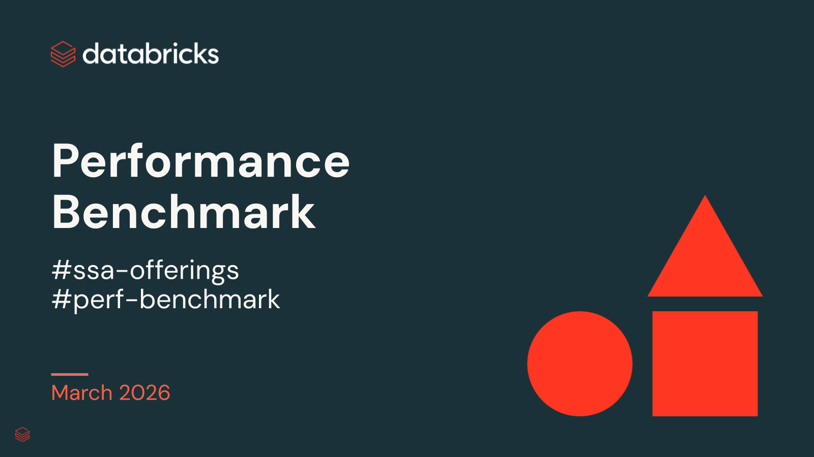

## DW Performance PoC Accelerator

> **SSA offering — how to engage:** If you are interested in this SSA Offering, follow the ASQ process (go/gethelp): Product Help > Pilot/Production Advisory; then put the tag #ssa-offering #dw-accelerator-poc-perf in both the **Title** and **Description** fields.

**GOAL:** Validate DBSQL capabilities with an automated PoC — establish scalability, performance, and cost savings of DBSQL, compare against legacy EDW, and present findings to decision makers with a formal readout

### Overview
The DW Performance PoC Accelerator is a structured engagement that helps customers validate Databricks SQL performance, scalability, and TCO against their existing data warehouse. Through a 4-step joint execution plan, specialists guide customers from benchmark alignment through automated performance testing to an executive readout with validated results.

### Key Milestones
- **Establish** the scalability, performance, and cost savings of DBSQL
- **Compare** performance and TCO savings of DBSQL vs. legacy EDW
- **Present** findings to decision makers with a formal readout

### GTM Signals — When to Engage
- Customer deciding on EDW migration to Databricks but needs proof on performance, scalability, and TCO on their own data
- Building internal business case against Synapse, Snowflake, Redshift — needs validated performance and cost numbers
- Internal pushback from skeptics who doubt DBSQL performance
- Evaluation needs to be production-scale but can't run on production data
- Customer saying: "We need to see numbers before we move forward", "How does DBSQL compare to Snowflake on performance?", "Can DBSQL support this many concurrent queries?", "How to right-size a DBSQL warehouse?"

### Technical Readiness Criteria
- Customer can jointly review and prioritize queries for benchmark
- Databricks workspace admin with DB Secrets + cluster-create permissions
- Network admin can provision Databricks workspace access to DW source systems

### Engagement Process (4-Step Joint Execution Plan)

**Step 1 — Align & Prepare** (8hrs FTE / 1 wk)
- Preparation: SA sends readiness checklist to confirm permissions, connectivity, data access
- Two 1 Hour Sessions: Align on benchmark scenario (industry benchmark vs. customer queries), define success criteria, identify stakeholders and exec sponsor
- Next Steps: Customer validates readiness checklist

**Step 2 — Validate Setup** (4hrs FTE / 1 wk)
- Preparation: SSA reviews benchmarking scenario, selected queries, and sizes DBSQL warehouse
- 1-2 One Hour Sessions: Confirm data, queries, and environment are correctly configured
- Next Steps: SA/SSA review query format, Delta table optimization, and validation notebook results to confirm the environment is ready for benchmarking; sends benchmark tool

**Step 3 — Performance Benchmarking** (16hrs FTE / 2 wks)
- Preparation: Environment validated; benchmark tooling, query set, and DBSQL warehouse sizing confirmed
- 1 Hour Session + 2 Week Sprint: Execute runs, review results, iterate with different configurations
- Next Steps: Consolidate results and materials for executive readout; adjust warehouse sizing if needed

**Step 4 — Executive Readout** (4hrs FTE / 1 wk)
- Preparation: SSA packages performance comparison, TCO summary, and executive-facing readout materials
- Half-Day Session: Final readout of performance comparisons and TCO + GVP Business Case
- Next Steps: Align on follow-on migration pilot*, PS/Partner engagement, or other next steps as appropriate

*Pilot is optional. Customers are recommended to seek PS or SI partner for DW migration in general.

### Customer Requirements
- Ability to jointly review and prioritize queries for benchmark
- Databricks workspace admin with DB Secrets and cluster-create permissions
- Network admin who can provision Databricks workspace access to DW source systems

### Links
- [pitch_deck](https://docs.google.com/presentation/d/156_vtdtN_354UjSdXpAznYh2dGa6zz_45wy9UvfY28g/edit)
